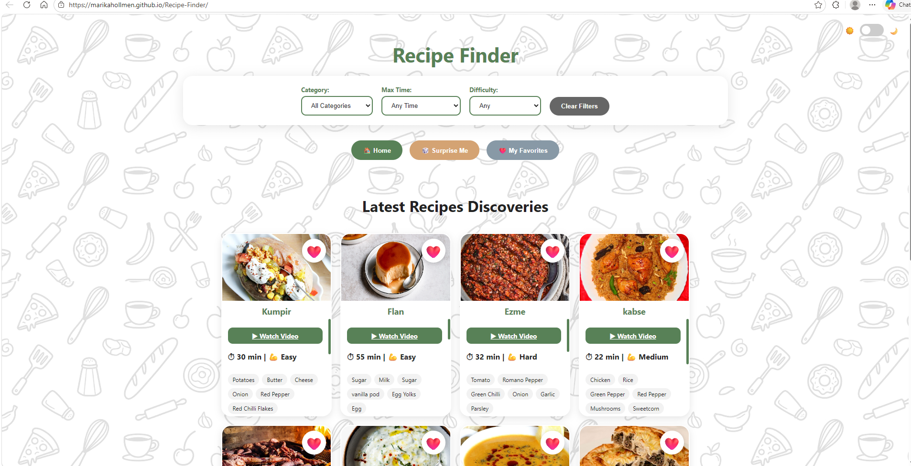
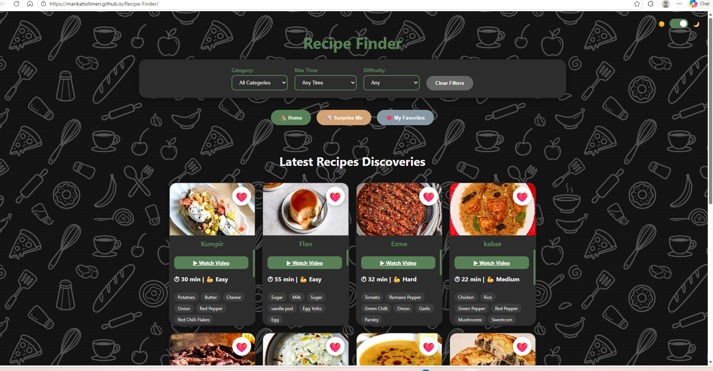

# Recipe Finder: Live Data Explorer

A modern, responsive single-page web application that allows users to discover, filter, and save recipes. The app fetches real-time data from **TheMealDB API**, demonstrating advanced asynchronous JavaScript techniques and dynamic DOM manipulation. This project was developed for the Web Applications course at **Laurea University of Applied Sciences**.

**Live Demo:** https://github.com/MarikaHollmen/Recipe-Finder

**Repository:** https://github.com/MarikaHollmen/Recipe-Finder.git
## Features

* **Real-time Data Fetching:** Utilizes the Fetch API with `async/await` to retrieve live recipe data from an external endpoint.
* **Dynamic Search & Filtering:** Filter recipes by category (e.g., Beef, Vegan, Dessert), preparation time, and difficulty levels.
* **Interactive Recipe Cards:** Detailed view of each recipe in a custom modal, including ingredients, step-by-step instructions, and YouTube integration.
* **Ingredient Checklist:** Users can toggle and strike-through ingredients as they cook to keep track of their progress.
* **Favorites Management:** Save and remove recipes from a personalized favorites list, which persists using `localStorage`.
* **Responsive UI:** A mobile-first design built with CSS Grid and Flexbox that adapts to any screen size.
* **Dark Mode:** A toggleable theme switcher that enhances user experience in low-light environments and remembers the user's preference.

## How to Run

### Windows & macOS

1. **Clone or Download:** Download the project files (`index.html`, `style.css`, `script.js`) into a single folder.
2. **Launch:** Open `index.html` directly in any modern web browser.
3. **For Developers:** It is highly recommended to use the **Live Server** extension in VS Code to ensure all assets and asynchronous requests load correctly.

## Architecture

The project maintains a strict **separation of concerns** to ensure code maintainability:

* **`index.html`**: Defines the semantic structure, including the search controls, results grid, and the modal container for recipe details.
* **`style.css`**: Contains all visual styling, utilizing CSS Variables for easy theme switching and a responsive Grid system for the recipe cards.
* **`script.js`**: Handles the application logic, including API requests, filtering algorithms, event handling, and data persistence with `localStorage`.

## Reflection

Building the **Recipe Finder** was a significant step in mastering asynchronous JavaScript. The primary learning goal was to understand how to handle "live" data—managing the delay between a request and a response while keeping the UI responsive.

One of the most challenging technical hurdles was implementing the **multi-layer filtering** system. Combining API-level category filtering with client-side filters for "Cooking Time" and "Difficulty" (which are calculated based on the recipe's complexity) required careful logic to ensure the UI stayed in sync. I also faced a common event-bubbling issue where clicking an ingredient checkbox in a small card would accidentally open the full recipe modal. I fixed this by implementing `event.stopPropagation()`, which was a great lesson in DOM event flow.

I used **GitHub Copilot** as a pair programmer to brainstorm efficient ways to map large JSON objects into HTML templates. It helped me refine my error-handling strategies, specifically using `try/catch` blocks to provide meaningful feedback to the user if the API is unreachable.

## Self-Assessment

| Criterion | Score | Evidence |
| --- | --- | --- |
| **API Integration** | 5/5 | Successful use of `fetch()` and `async/await` with TheMealDB JSON endpoint. |
| **Dynamic DOM & UI** | 5/5 | Responsive Grid layout, template literals for cards, and loading states. |
| **Code Quality** | 5/5 | Clean separation of HTML/CSS/JS and defensive coding with `try/catch`. |
| **UX & Accessibility** | 5/5 | Fully responsive design, Dark Mode, and intuitive navigation. |
| **Data Handling** | 5/5 | Reliable use of `localStorage` for favorites and data sanitization. |

## Screenshots

### Light Mode

### Dark Mode

## Project Presentation Video

**Video Link:** [Insert your Loom/YouTube/OneDrive link here]

**Maximum length:** 5–6 minutes.

**Video Timestamps:**

* **0:00** – Introduction: Project overview and learning goals.
* **1:15** – The Code: Walkthrough of the `fetch()` function and DOM mapping logic.
* **3:00** – The App: Demonstrating search, category filtering, and loading states.
* **4:15** – Mobile View: Showcasing responsiveness and the ingredient checklist.
* **5:00** – Reflection: Summary of key fixes and new skills learned.